# Công cụ Gán Nhãn Corpus Tiếng Việt (Vietnamese Corpus Annotation Tool)

## Mục đích
Công cụ này được phát triển nhằm hỗ trợ hiệu quả quá trình gán nhãn Part-of-Speech (POS) cho dữ liệu corpus tiếng Việt, phục vụ các nghiên cứu và ứng dụng trong lĩnh vực Xử lý Ngôn ngữ Tự nhiên.

## Demo
Xem video demo giới thiệu các chức năng chính của công cụ tại: [Demo tool](https://drive.google.com/file/d/1xaKN_lUedo78BS2XPsbwlGNmR7zakeg1/view?usp=sharing)

## Cấu trúc Hệ thống và Các Thành phần Chính
Hệ thống công cụ gán nhãn bao gồm các module chính sau:

*   **Công cụ Tiền xử lý (Preprocessing Tool):** Hỗ trợ chuẩn hóa, làm sạch và chuyển đổi định dạng dữ liệu corpus từ nguồn sang các định dạng phù hợp cho việc gán nhãn và xử lý tiếp theo.
*   **Công cụ Gán nhãn (Annotation Tool):** Nền tảng chính cho việc thực hiện gán nhãn dữ liệu thủ công bởi các chuyên gia (annotator).
*   **Công cụ Phân tích Gán nhãn (Annotation Analysis Tool):** Dùng để thống kê, đánh giá chất lượng gán nhãn, đo lường độ đồng thuận giữa các annotator và phân tích kết quả gán nhãn.
*   **Công cụ Gán nhãn Tự động (Auto Annotation Tool):** Sử dụng mô hình học máy để gợi ý nhãn ban đầu cho dữ liệu, giúp tăng tốc độ gán nhãn thủ công và đảm bảo tính nhất quán ban đầu.

## Hướng dẫn Cài đặt & Sử dụng

### 1 - Công cụ Tiền xử lý (Preprocessing Tools)
Phần này mô tả các công cụ được phát triển để xử lý dữ liệu corpus trước khi đưa vào nền tảng gán nhãn.

#### 1.1 - Chuyển đổi dữ liệu Vietnam Treebank sang định dạng POS
Công cụ: [convert_to_vn_pos](convert_to_vn_pos.ipynb)
Công cụ này chuyển đổi cấu trúc dữ liệu dạng cây từ corpus Vietnam Treebank sang định dạng chuỗi từ-nhãn (token-POS tag) phù hợp cho tác vụ gán nhãn POS.

#### 1.2 - Công cụ Chia dữ liệu
Công cụ: [split_data](split_data.ipynb)
Công cụ này chia tập dữ liệu đã tiền xử lý thành ba tập con phục vụ các mục đích khác nhau: train, dev, và test. Quy trình chia dữ liệu được thực hiện như sau:
1.  **Tạo tập Train:** Chọn N câu (ví dụ: 500 câu) để sử dụng làm dữ liệu huấn luyện cho mô hình gán nhãn tự động.
2.  **Tạo tập Dev:** Chuẩn bị dữ liệu cho các annotator thực hiện gán nhãn thủ công ban đầu.
3.  **Tạo tập Test:** Tạo tập dữ liệu độc lập để đánh giá kết quả gán nhãn thủ công và/hoặc hiệu suất của mô hình tự động.
4.  Mỗi tập (train, dev, test) có thể được chia nhỏ thành các bộ (batch) dữ liệu để dễ quản lý và phân công cho annotator.

#### 1.3 - Chuyển tập dữ liệu Phát triển (Dev set) sang định dạng Thô (Raw data)
Công cụ: [convert_dev_to_raw](RAW.ipynb)
Công cụ này chuyển đổi tập dữ liệu phát triển (dev set) từ định dạng đã qua tiền xử lý sang định dạng dữ liệu thô (chỉ văn bản) để chuẩn bị cho quá trình gán nhãn thủ công trong Annotation Tool.

#### 1.4 - Chuyển đổi định dạng dữ liệu sang Annotation Tool
Công cụ: [Convert_to_annotation_tool](ConvertToLasbelStudioFormat.ipynb)
Công cụ này chuyển đổi định dạng dữ liệu đã tiền xử lý sang format tương thích với Công cụ Gán nhãn (cụ thể là Label Studio), đảm bảo nhập liệu dễ dàng và hiệu quả cho tác vụ gán nhãn POS.

### 2 - Công cụ Gán nhãn (Annotation Tool) - Label Studio
Nhóm sử dụng nền tảng mã nguồn mở Label Studio để thực hiện việc gán nhãn dữ liệu thủ công.

#### Yêu cầu
*   Python 3.8+
*   Docker (khuyến nghị để triển khai dễ dàng)

#### Cài đặt
Sử dụng pip để cài đặt Label Studio:
```bash
pip install label-studio
```
Hoặc sử dụng Docker để chạy Label Studio trong container (khuyến nghị):
```bash
docker run -it -p 8080:8080 -v $(pwd):/label-studio-data open-label-studio/label-studio:latest
```
*(Lệnh `$(pwd)` giúp map thư mục hiện tại trên máy host vào trong container để lưu trữ dữ liệu dự án, đảm bảo dữ liệu không bị mất khi dừng container).*

#### Khởi động Label Studio
Sau khi cài đặt, chạy lệnh sau để khởi động Label Studio (nếu không dùng Docker):
```bash
label-studio start
```
Truy cập địa chỉ `http://localhost:8080` trên trình duyệt web để bắt đầu sử dụng giao diện người dùng của Label Studio.

#### Sử dụng Label Studio để gán nhãn
Các bước cơ bản để thiết lập project gán nhãn POS trong Label Studio:

1.  Nhấn **Create project** để tạo một dự án gán nhãn mới.
    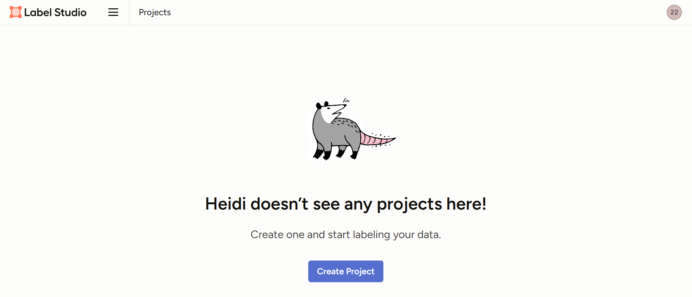

2.  Nhập tên dự án (Project Name) và chọn **Labelling Set up** để cấu hình loại tác vụ gán nhãn.
    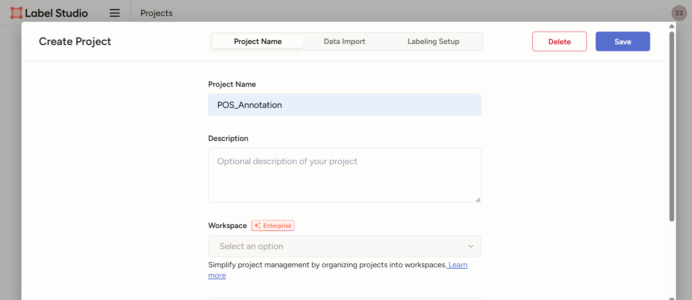

3.  Trong phần "Labelling Set up", chọn loại bài toán là **Natural Language Processing** và kiểu tác vụ là **Named Entity Recognition** (để gán nhãn các đoạn text/từ).
    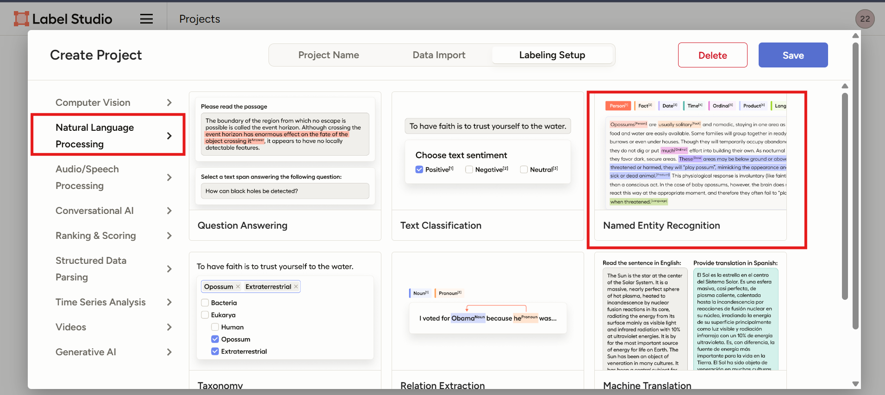

4.  Cấu hình giao diện gán nhãn bằng cách cung cấp danh sách các nhãn POS cần gán. Sử dụng template HTML sau trong phần "Custom template":
    ```html
    <View>
      <Labels name="label" toName="text">
        <Label value="N" background="#FFA39E"/>   <!-- Danh từ chung -->
        <Label value="Np" background="#FFD666"/>  <!-- Danh từ riêng -->
        <Label value="Nc" background="#91D5FF"/>  <!-- Danh từ chỉ loại -->
        <Label value="Nu" background="#B7EB8F"/>  <!-- Danh từ đơn vị -->
        <Label value="Ny" background="#FFC069"/>  <!-- Từ viết tắt là danh từ -->
        <Label value="Nb" background="#69C0FF"/>  <!-- Danh từ phụ kỹ thuật -->
        <Label value="V" background="#D3ADF7"/>   <!-- Động từ -->
        <Label value="A" background="#5CDBD3"/>   <!-- Tính từ -->
        <Label value="P" background="#A7E8A7"/>   <!-- Đại từ -->
        <Label value="L" background="#FF85C0"/>   <!-- Định từ -->
        <Label value="M" background="#FFA940"/>   <!-- Số từ -->
        <Label value="R" background="#D9D9D9"/>   <!-- Phó từ -->
        <Label value="E" background="#FF6666"/>   <!-- Giới từ -->
        <Label value="C" background="#66CCFF"/>   <!-- Liên từ -->
        <Label value="I" background="#99FF99"/>   <!-- Thán từ -->
        <Label value="T" background="#FF99CC"/>   <!-- Trợ từ -->
        <Label value="U" background="#CC99FF"/>   <!-- Từ đơn lẻ -->
        <Label value="Y" background="#CCCCCC"/>   <!-- Từ viết tắt -->
        <Label value="X" background="#000000" textColor="#FFFFFF"/>  <!-- Từ không phân loại -->
      </Labels>
      <Text name="text" value="$text"/>
    </View>
    ```
    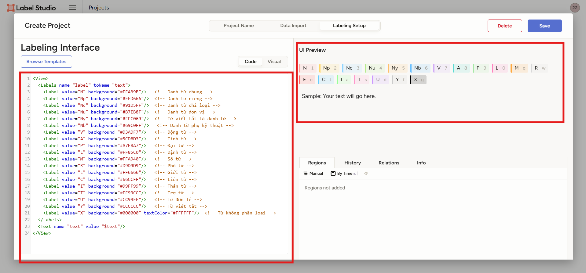

5.  Lưu cấu hình và chuyển sang bước tiếp theo.
    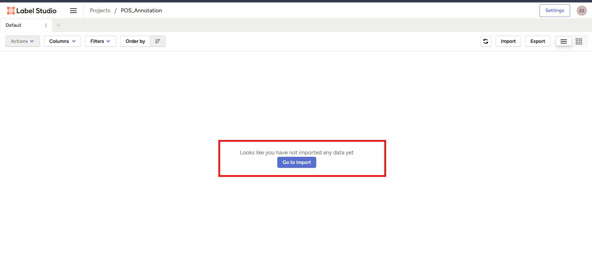

6.  Cấu hình xong, bạn sẽ thấy giao diện chuẩn bị Import dữ liệu.
    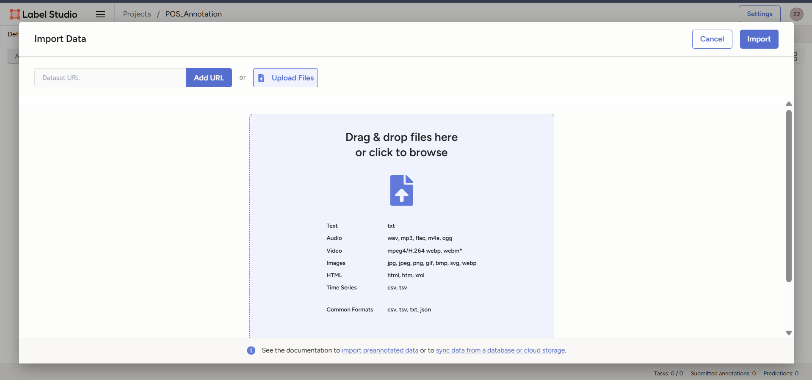

7.  Bắt đầu **Import** dữ liệu vào dự án. Hãy sử dụng công cụ ở mục 1.4 để chuẩn bị dữ liệu đầu vào ở định dạng phù hợp cho Label Studio.
    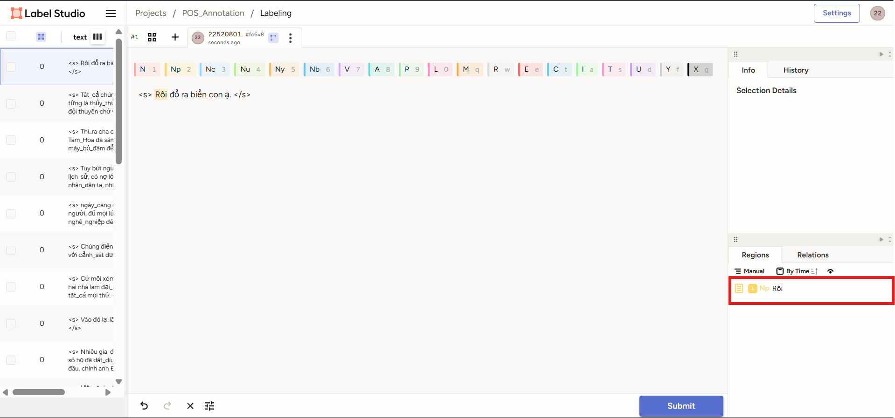

8.  Sau khi dữ liệu được import, bạn có thể bắt đầu gán nhãn. Chọn nhãn POS từ danh sách và bôi đen (quét) từ hoặc cụm từ tương ứng trong văn bản để gán nhãn. Có thể xóa nhãn đã gán bằng cách chọn nhãn trên text và nhấn nút xóa hoặc phím Delete.

9.  Sau khi hoàn thành gán nhãn, nhấn **Export** để xuất dữ liệu đã gán nhãn ra file. Dữ liệu xuất ra thường được lưu trong thư mục `export` tại vị trí chạy Label Studio.

### 3 - Công cụ Phân tích Gán nhãn (Annotation Analysis Tool)
Công cụ này giúp đánh giá chất lượng gán nhãn và sự đồng nhất giữa các annotator dựa trên dữ liệu đã xuất từ Label Studio.
Kho lưu trữ công cụ: [Web Annotation Tool](https://github.com/loingtan/Web-Annotation-Tool)
Hướng dẫn sử dụng chi tiết có trong repository của công cụ.

Một số tính năng phân tích tiêu biểu được minh họa qua các hình ảnh:

*   **Thống kê số lượng nhãn:** Thống kê số lượng nhãn được gán bởi từng annotator và so sánh với tập dữ liệu tham chiếu (nếu có).
    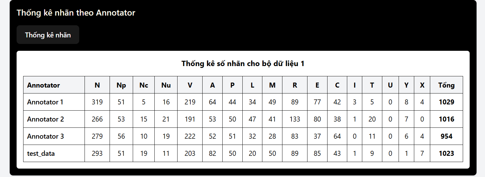

*   **Đánh giá độ đồng thuận và độ chính xác:** Đo lường độ đồng thuận (agreement) giữa các annotator (ví dụ: Cohen's Kappa, Fleiss' Kappa) và độ chính xác (precision, recall, F1-score) của từng annotator so với dữ liệu tham chiếu.
    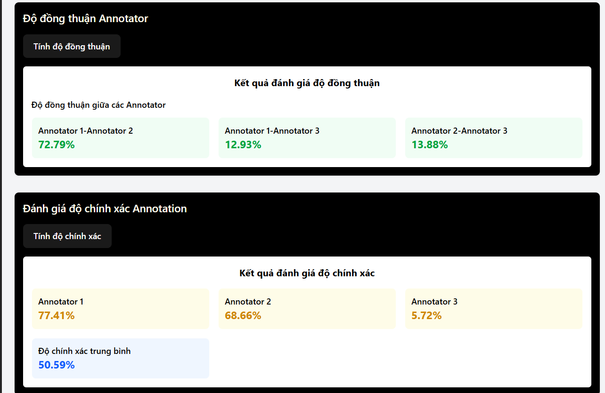

*   **Xem chi tiết gán nhãn từng câu:** Hiển thị thông tin gán nhãn của từng annotator trên mỗi câu. Cung cấp tùy chọn so sánh trực quan kết quả gán nhãn giữa các annotator trên cùng một câu.
    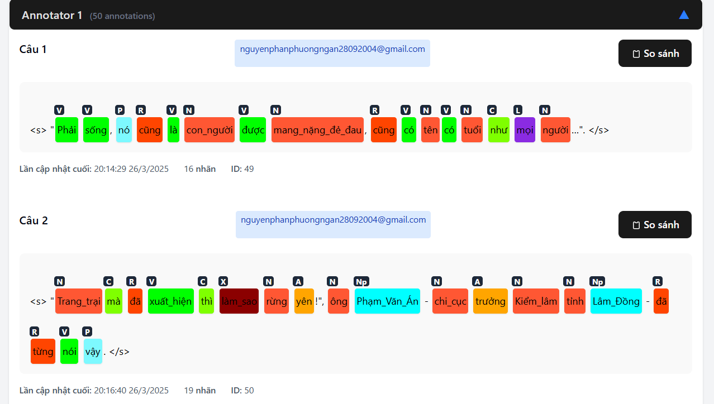

*   **So sánh kết quả giữa các Annotator:** Giao diện so sánh chi tiết sự khác biệt trong gán nhãn giữa các annotator.
    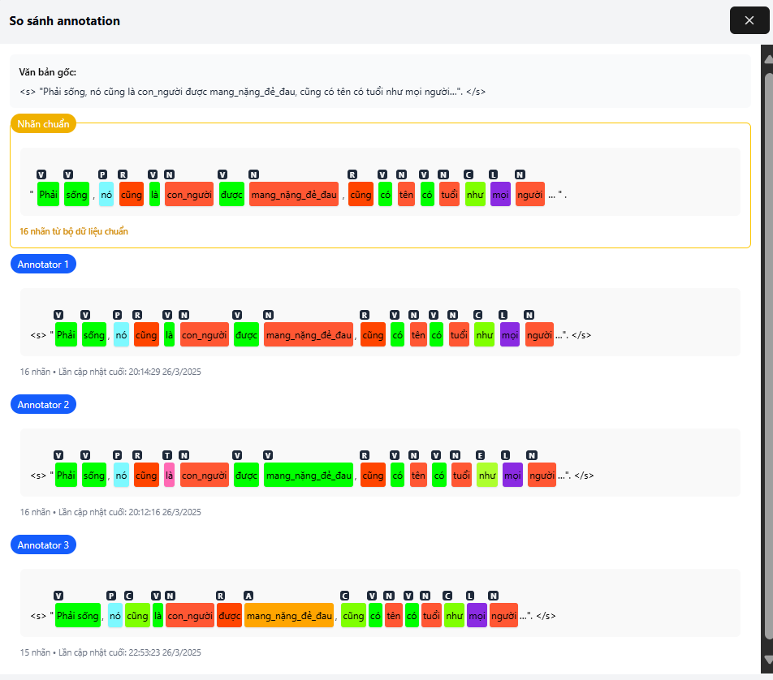

### 4 - Công cụ Gán nhãn Tự động (Auto Annotation Tool)
Công cụ này sử dụng một mô hình POS tagging đã được huấn luyện để dự đoán nhãn cho dữ liệu thô, tạo ra một phiên bản gán nhãn ban đầu giúp annotator tiết kiệm thời gian và định hướng gán nhãn theo mô hình.

#### Hướng dẫn sử dụng
Truy cập vào thư mục chứa công cụ:
```bash
cd pre_annotate_label
```

Cài đặt các thư viện cần thiết:
```bash
pip install -r requirements.txt
```

Chạy công cụ với các tham số đầu vào:
```bash
python pre_annotate.py --input ./text_files --output ./annotations --model ./model.pkl
```
Trong đó:
*   `--input`: Đường dẫn đến thư mục chứa các tệp văn bản (.txt) cần được gán nhãn tự động.
*   `--output`: Đường dẫn đến thư mục sẽ lưu trữ kết quả gán nhãn dưới dạng tệp.
*   `--model`: Đường dẫn đến tệp mô hình POS tagging đã huấn luyện (.pkl) được sử dụng để dự đoán nhãn.

Công cụ này áp dụng mô hình đã huấn luyện từ tập train (hoặc tập dữ liệu khác) để dự đoán nhãn cho dữ liệu thô (ví dụ: tập dev), hỗ trợ quá trình gán nhãn thủ công bằng cách cung cấp gợi ý nhãn ban đầu, góp phần tăng tốc độ gán nhãn và duy trì tính đồng nhất.

# References
[Guideline VLSP](media/Guideline%20VLSP.pdf)